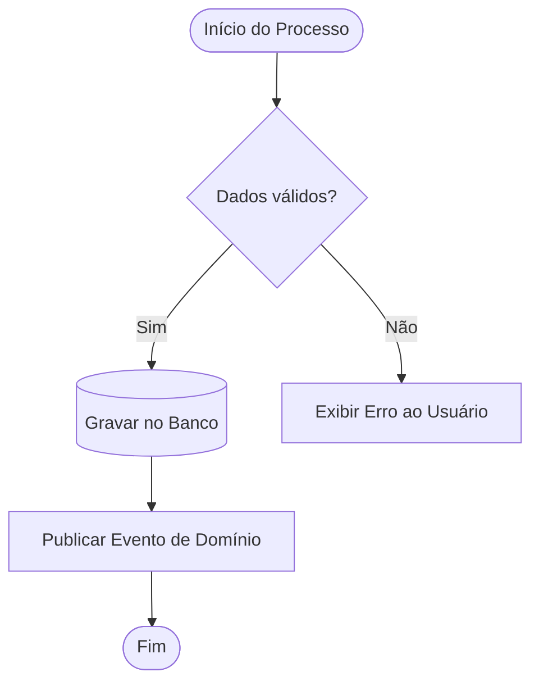
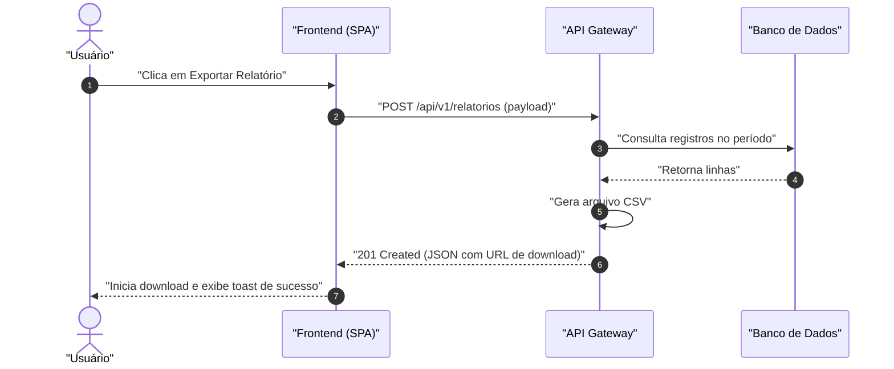
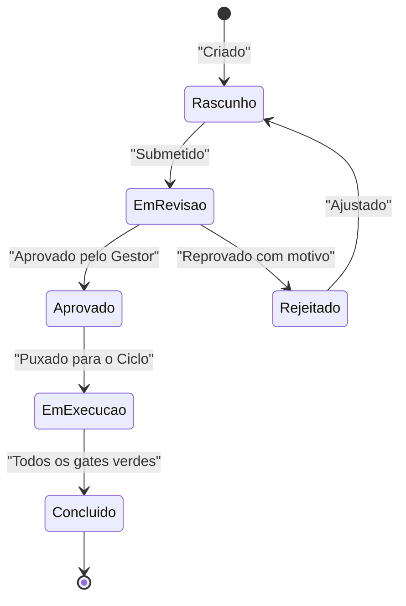
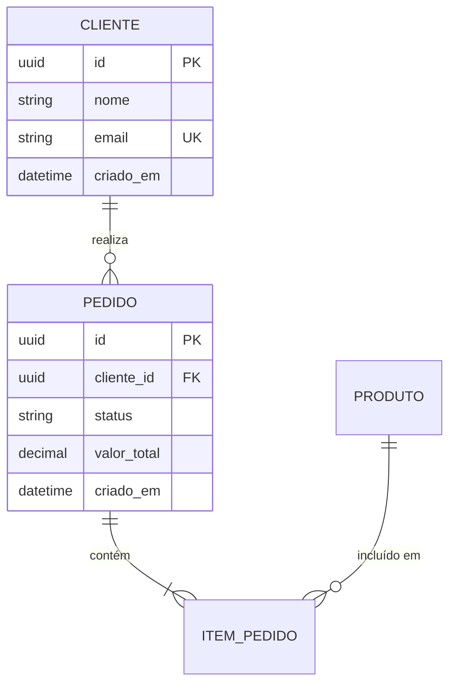

# Habilidade · Diagramação com Mermaid

Esta habilidade padroniza a criação de diagramas técnicos usando Mermaid em arquivos de rascunho (`docs-mentor/rascunhos/`) e arquitetura (`docs-mentor/arquitetura/ADR/`).

---

## 1. Regras de Ouro para Evitar Quebras de Sintaxe

IAs frequentemente quebram renderizadores Mermaid ao usar caracteres especiais. Siga rigorosamente:

1. **Sempre use aspas duplas em rótulos de nós**:
   - ❌ Errado: `A[Criar Conta (PF ou PJ)] --> B`
   - ✅ Correto: `A["Criar Conta (PF ou PJ)"] --> B`
2. **Nunca use tags HTML dentro de rótulos**:
   - ❌ Errado: `A["Nome   Descrição"]`
   - ✅ Correto: `A["Nome - Descrição"]`
3. **Identificadores simples sem espaço**:
   - Use IDs como `nodeA`, `dbPostgres`, `apiGateway` e coloque o texto descritivo entre colchetes/aspas.

---

## 2. Modelos de Referência

### A. Fluxograma de Processo de Negócio (`flowchart TD` ou `LR`)

### B. Diagrama de Sequência (`sequenceDiagram`)

### C. Diagrama de Estados (`stateDiagram-v2`)

### D. Modelo de Entidade-Relacionamento (`erDiagram`)

