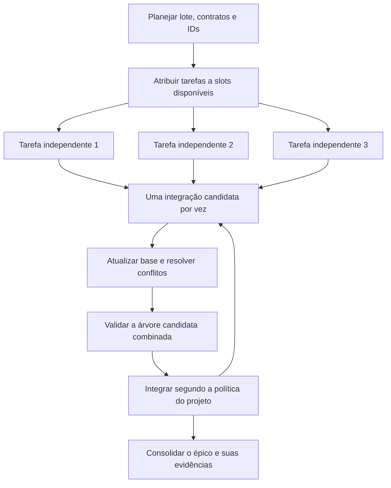

# Protocolo operacional e contratos comuns

Este documento especifica o comportamento alvo. Os comandos Git/Mentor existentes são identificados como exemplos; a extensão do diagnóstico e os retornos mais estritos do resolvedor serão implementados nas fatias B e C.

## Responsabilidades temporárias

O responsável pelo lote prepara contratos, IDs e atribuições. Cada executor planeja a sua tarefa, implementa, valida e deixa memória para a sessão seguinte. O revisor examina a mudança conforme a política do projeto. O responsável pela integração coordena a entrada dos candidatos e a evidência combinada. Essas funções podem ser distribuídas entre humanos ou agentes e reatribuídas a cada lote. Quando revisão independente for exigida, a sessão autora não emite seu próprio parecer como independente.

Exemplo substituível: no lote 1, Codex assume uma API, Claude assume UI e Antigravity assume testes de contrato; no lote 2 a distribuição muda. A independência das tarefas e a capacidade da sessão determinam a atribuição. A–E são fatias do plano; `slot-a`–`slot-c` são recursos físicos, sem ligação permanente entre as duas nomenclaturas.

## Topologia e ambiente

```text
mentor-agent/                # checkout de integração/planejamento
mentor-agent-slot-a/         # tarefa e branch exclusivas da sessão atual
mentor-agent-slot-b/
mentor-agent-slot-c/
```

A topologia ilustrativa usa uma árvore de integração e três slots de execução. Se o checkout principal também executar tarefas, ele conta como um slot: três execuções exigem três árvores disponíveis, e a integração pode ser feita depois ou via CI/PR. Não há exigência de quatro diretórios.

Worktrees compartilham refs, objetos, parte da configuração e normalmente hooks. HEAD e índice são separados. Arquivos ignorados, dependências, bancos, diretórios de saída e processos não ganham isolamento automático.

Exemplo de preparação futura, após confirmar que `origin/main` é a referência principal atualizada e que esses nomes/pastas estão livres:

```bash
git fetch origin
git worktree list --porcelain
git worktree add -b codex/slot-a-idle ../mentor-agent-slot-a origin/main
git worktree add -b codex/slot-b-idle ../mentor-agent-slot-b origin/main
git worktree add -b codex/slot-c-idle ../mentor-agent-slot-c origin/main
```

Usar o prefixo de branches escolhido pelo projeto; `codex/` é a convenção deste ambiente e não restringe qual modelo pode usar a branch. Em projeto sem remoto, usar a referência principal local. Nunca adicionar `--force` para ocupar uma branch já ativa em outra árvore.

Na primeira preparação, executar `npm ci` em cada slot com lockfile. Repetir quando lockfile, versão do runtime ou dependências relevantes mudarem. Cache do gerenciador pode ser compartilhado; `node_modules` mutável não deve ser um link comum entre slots. Configurar ambiente local ignorado conforme o projeto.

Reservar portas e namespaces para banco, schema, filas, arquivos temporários, volumes e diretórios de saída quando houver uso simultâneo. Os números `3000/3001/3002` são exemplos; o Mentor não assume que o produto tenha servidor nessas portas.

## Contrato de atribuição e handoff

O modelo de atribuição será Markdown, com referência à fonte de estado do Mentor. Ele descreve a sessão; não substitui JSONs de tarefa nem uma consulta de andamento.

| Campo | Obrigação |
|---|---|
| Tarefa e fonte do plano | ID gerado e estudo/contrato que a sessão deve ler |
| Objetivo e aceite | Resultado observável e evidência esperada |
| Slot e branch | Caminho da árvore e branch exclusivos durante a escrita |
| Base | SHA/ref sobre a qual a sessão iniciou o trabalho |
| Escopo | Arquivos/globs em `plano.muda` e fronteiras compartilhadas |
| Contratos | Entradas, saídas, erros, tipos e compatibilidade entre fatias |
| Dependências | IDs reais, motivo de precedência e condição de liberação |
| Recursos locais | Portas, bases, diretórios e configuração ignorada utilizados |
| Sessão atual | Identificação operacional substituível, sem papel fixo de modelo |
| Validação e entrega | Comandos, limitações, local da evidência e destino da integração |

Para trocar a sessão: parar a escrita anterior, conservar alterações e histórico da tarefa, informar branch/HEAD, git status, trabalho pendente, gates realmente executados e recursos ativos. A nova sessão lê o estudo completo e os registros locais antes de continuar. Não fechar a tarefa nem reiniciá-la só porque mudou o modelo.

## Cadastro, início e execução

1. Refinar o plano do lote e o contrato comum. Tarefa bloqueada por decisão real fica dependente; diferenças de nome de modelo não criam dependências.
2. Criar pai e fatias sequencialmente numa branch de planejamento. Preencher `plano_do_epico`, contratos entre fatias e narrativas. Usar os IDs emitidos pelo CLI.
3. Tornar esse planejamento disponível na base compartilhada conforme a política de integração. Se ainda não estiver integrado, declarar explicitamente a dependência da branch de planejamento e esperar sua disponibilização antes do início das tarefas de código.
4. Atribuir tarefas distintas aos slots. Antes de trocar branch, exigir árvore sem alterações pendentes e sem merge/rebase em curso; confirmar que a tarefa anterior está preservada.
5. Criar branch de tarefa a partir da base atualizada, sem checkout intermediário da `main` naquele slot. Exemplos `git switch -c codex/task-<ID> origin/main`; substituir `<ID>` pelo ID real. Branch existente é retomada explicitamente.
6. Executar `task puxar`, vincular o plano da fatia e `task iniciar` conforme o ciclo. Completar os campos que o contrato portátil não fornece e cumprir o Portão 1/autorização já existente.
7. Implementar apenas o escopo atribuído, executar os gates pertinentes, conservar a narrativa integral e registrar limitações. Encontrar necessidade de alterar contrato compartilhado exige coordenação antes de avançar com as dependentes.

O limite `em_execucao` vale para a árvore consultada. O cadastro comum distribuído deve estar sem tarefas intermediárias já em execução; copiar o estado ativo de outra sessão pode produzir diagnóstico de duplicidade e precisa ser esclarecido.

## Integração de candidatos



O primeiro pronto entra primeiro somente se estiver elegível. Os seguintes atualizam suas branches depois dessa integração. PR independente pode subir quando estiver pronto; a orientação de push único é restrita a lote sequencial deliberadamente mantido na mesma branch. Backup WIP permanece separado de merge elegível.

Na branch candidata, com trabalho salvo e árvore limpa:

```bash
git fetch origin
git merge origin/main
# Se houver conflito em fonte tratada pelo Mentor:
node mentor.mjs resolver-gerados
git diff --name-only --diff-filter=U
git diff --cached
```

Confirmar retorno do merge e do resolvedor, ausência de conflitos e conteúdo staged. O resolvedor já realiza `git add` nos arquivos que trata. Nunca concluir um merge por retorno zero sem conferir o índice e a evidência do candidato. Os exemplos não incluem commit/push automático: fazê-los conforme autorização e política do projeto.

Produção, testes, narrativas e catálogo de planos podem exigir decisão própria. Resolver `docs/planos.json` preservando registros e hashes correspondentes aos arquivos reais. Criar novo ID para colisão de tarefas exige atualizar referências deliberadamente; não transformar duas tarefas distintas com o mesmo ID numa tarefa fundida.

Se houver alteração de código/insumo relevante durante a atualização, a evidência anterior deixa de provar essa árvore: repetir o gate apropriado e registrar a nova evidência. Em tarefa já concluída, a validação posterior pode ser anexada via `task anexar` quando vier de CI, sem reescrever o estudo passado nem inventar um novo `finalizar`.

PRs seguem as regras do consumidor; integração local permitida ocorre numa única árvore de integração, uma operação por vez. Nenhuma sessão faz fetch que avança a branch principal local por refspec enquanto ela está em checkout em outra árvore. Usar as refs de acompanhamento remoto.

## Reciclagem, pausa e recuperação

- Reciclar slot preservando a branch anterior e seus registros; parar processos locais e conferir status antes de trocar a branch. Não usar reset/clean para apagar trabalho desconhecido.
- Não exigir deletar a branch para liberar o slot. Squash não mantém necessariamente ancestralidade e a principal pode conter mudanças adicionais: diff não vazio não prova que a entrega está ausente. Consultar PR/commit integrado e diferenças atribuíveis à tarefa antes de qualquer exclusão.
- Pausar com o comando existente e motivo quando houver bloqueio. Para retomar trabalho com `commit_pausa`, seguir merge antes de `task retomar`; rebase pode invalidar a referência gravada.
- Falha no merge exige preservar estado e decidir resolver ou abortar. Falha de gate mantém candidato fora da integração até correção ou exceção formal permitida pelo projeto.
- Slot ausente, disco desmontado ou arquivos ilegíveis são informação incompleta. O `doctor` informa o limite da leitura; não conclui que uma tarefa terminou nem poda a worktree.

## Contratos das extensões planejadas

**Doctor:** diagnóstico somente de leitura, com caminho, branch/HEAD, raiz administrativa, IDs locais em execução e limite local. Total entre worktrees é informativo. Mesmo ID ativo em mais de uma árvore gera aviso de possível atribuição duplicada, sem afirmar ownership só pelo JSON; múltiplos IDs distintos ativos em árvores distintas são permitidos. Árvores ausentes, detached ou sem Mentor são identificadas. O recorte é o mesmo projeto relativo dentro do checkout, para não confundir monorepos. `MENTOR_RAIZ` da sessão não redireciona silenciosamente a leitura das irmãs.

**Resolvedor:** em repositório Git, status 0 exige arquivos tratados válidos, stage bem-sucedido e índice sem entradas não resolvidas. Falha de parse/fusão/gravação/stage ou conflito remanescente retorna 1 e informa caminhos. Arquivo cujo tratamento falhou conserva a evidência de conflito e não é adicionado ao stage como resolvido. Conflitos fora da cobertura permanecem intactos; listas de fontes e vistas são explícitas. Fora de Git, regeneração de fontes válidas sem marcadores pode concluir com sucesso, informando que não houve verificação de índice; esse resultado não comprova um merge. Marcadores sem base confiável retornam erro. Não se introduz neste épico uma política nova para arbitrar respostas humanas conflitantes ou fundir automaticamente qualquer JSON.

**Observabilidade:** diagnóstico é fotografia, sem reserva atômica. Cadastro sequencial e handoff humano/operacional estabelecem ownership. Coordenação entre clones ou máquinas fica fora da leitura de worktrees locais.
