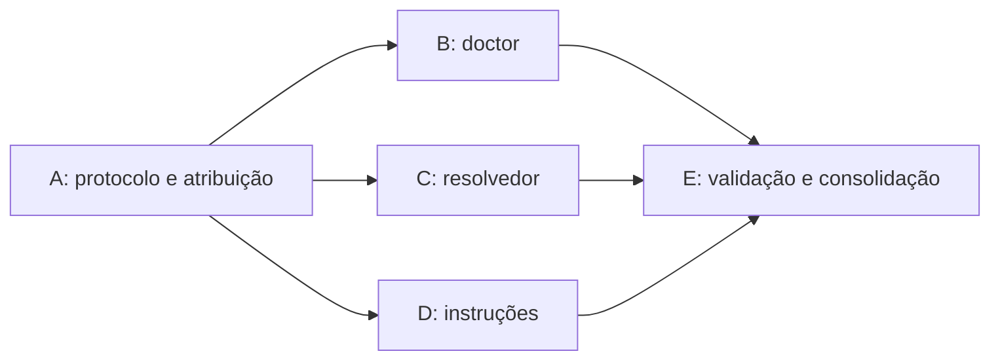

# Fatias, dependências e validação

## Grafo de execução



A estabiliza o contrato que orienta as três frentes seguintes. B, C e D podem avançar juntas porque têm arquivos de implementação distintos. E depende das três para verificar o fluxo completo e centralizar arquivos compartilhados. Essa ordem decorre dos artefatos consumidos, não de quem executa cada fatia.

| Fatia | Escopo exclusivo previsto | Depende de | Entrega para as próximas |
|---|---|---|---|
| A | `.mentor/processos/trabalho-paralelo.md`, `.mentor/modelos/atribuicao-paralela.md`, padrão Git local em `docs/padroes-de-stack/git.md` | — | Protocolo, atribuição e convenção local |
| B | `.mentor/scripts/worktrees.ts`, `.mentor/scripts/cmd-doctor.ts`, `testes/worktrees-paralelas.test.ts` | A | Diagnóstico de worktrees e aviso de duplicidade |
| C | `.mentor/scripts/cmd-resolver.ts`, `testes/resolvedor-paralelo.test.ts` | A | Status confiável, preservação de falhas e stage conferido |
| D | Processos existentes de planejamento/tarefa/entrega/teste, skill de planejamento, ajuda em `cli.ts` e `README.md` | A | Instruções coerentes e pontos de descoberta do protocolo |
| E | Cenário novo de concorrência, runners de testes, `testes/README.md`, `CHANGELOG.md`, manifesto do pacote | B, C, D | Evidência integrada e pacote consistente |

As fronteiras são propostas para o código observado. Antes de iniciar cada fatia, confirmar caminhos e refinar o contrato. Se B ou C precisar de `tipos.ts`, `arquivos.ts`, runner comum ou outro arquivo compartilhado, registrar a necessidade e atribuir essa alteração a uma única frente. Não editar esses arquivos simultaneamente por conveniência.

B/C criam seus arquivos de teste; E centraliza os imports no runner de unidades. Antes de E, provas focadas importam diretamente cada suíte usando `executarSuites`, evitando disputa pelo runner. O manifesto e o changelog são consolidados por E. Divergência de manifesto enquanto as alterações do pacote estão em andamento é transitória e não deve ser mascarada como validação concluída.

## Matriz de aceite

| ID | Cenário e asserção | Prova prevista | Fatia |
|---|---|---|---|
| CP-01 | Modelo ou sessão muda de frente sem renomear tarefa, branch ou slot e sem perda do estudo | Revisão do protocolo e exercício de handoff | A/D |
| CP-02 | Três tarefas distintas iniciam em três worktrees sobre o mesmo cadastro, com limite local 1 | Repositório temporário real e estados locais conferidos | B/E |
| CP-03 | Mesmo ID em execução em duas worktrees gera aviso de possível duplicidade; IDs distintos não são bloqueados pelo total | Teste de leitura/diagnóstico e cenário Git | B/E |
| CP-04 | Raízes `docs/`, `docs-mentor/` e projeto em subpasta são lidas corretamente; env da sessão não troca a raiz irmã | Testes do módulo de leitura com caminhos explícitos | B |
| CP-05 | Worktree ausente, detached, não inicializada ou com JSON inválido aparece como informação limitada, preservando os demais resultados | Casos focados com retorno legível | B |
| CP-06 | Doctor conserva bytes dos registros nas árvores, índices e refs; nenhuma consulta faz fetch, reserva ou escrita | Snapshots antes/depois em cenário isolado | B/E |
| CP-07 | Merge real de metadados conhecidos preserva adições dos dois lados, regenera vistas e não deixa conflito no índice | Merge com estágios 1/2/3 e leitura dos JSONs resultantes | C/E |
| CP-08 | Erro de JSON/fusão em contexto, requisitos, dívidas ou riscos retorna 1 e não marca o arquivo problemático como resolvido | Teste de falha com índice ainda não resolvido | C |
| CP-09 | Conflito em código, narrativa ou catálogo de planos permanece intacto e é informado; retorno 1 até a decisão humana/operacional | Fixture de conflito fora da cobertura | C/E |
| CP-10 | Falha de stage/gravação é reportada como falha; ausência de Git não gera falso diagnóstico de índice limpo | Caso controlado de erro, sem depender de permissões do usuário executor | C |
| CP-11 | Segunda branch integra a primeira, mantém ambas as tarefas concluídas e suas narrativas e passa a validação do conjunto | Remoto bare local e integração serial | E |
| CP-12 | Mudar insumo relevante torna evidência anterior insuficiente; gerado administrativo sem alteração relevante segue a política existente | Reusar provas de fingerprint e acrescentar caso somente se houver lacuna | C/E |
| CP-13 | ID atribuído não é criado concorrendo em outra árvore; colisão distinta não é fundida como uma única tarefa | Protocolo de cadastro e prova existente de colisão de requisito | A/C/D |
| CP-14 | Push por branch paralela pronta é compatível com PR; regra de lote sequencial não obriga agrupar branches independentes | Revisão dos processos e pronto-para-merge no cenário | D/E |
| CP-15 | Pausa/retomada conserva `commit_pausa`, branch e histórico ao trocar a sessão | Reusar cenário WIP existente; complementar só se necessário | A/D/E |

CP-07 não promete arbitrar qualquer divergência humana. Preserva as políticas semânticas atuais dos arquivos cobertos. CP-09 exige status honesto, mantendo conflitos não tratados para resolução explícita. Não há extensão genérica de merge de planos, narrativas, referências e invariantes neste épico.

## Estratégia de prova

Para A/D, revisar coerência, exemplos, links e frontmatter. Não criar testes que apenas buscam frases novas. B/C exigem provas comportamentais: em B, caminhos e diagnóstico; em C, retorno, conteúdo preservado e estado do índice. E faz a prova que funções isoladas não conseguem fornecer: duas/três worktrees reais sobre o mesmo Git e entrada serial das mudanças.

Usar o harness existente `testes/vitest-local.ts`; não instalar Vitest nem outra biblioteca só porque os nomes `describe/it/expect` se parecem com ele. Testes novos têm timeouts próprios para subprocessos, usam pastas temporárias e remoto bare local, sem rede e sem exigir segredos ou serviços do produto.

Exemplo de execução focada antes de registrar a suíte B no runner comum, a partir da raiz do pacote:

```bash
node --input-type=module -e 'import "./testes/worktrees-paralelas.test.ts"; const { executarSuites } = await import("./testes/vitest-local.ts"); const r = executarSuites(); console.log(r); process.exitCode = r.total > 0 && r.falhas.length === 0 ? 0 : 1;'
```

Para C, substituir o import por `./testes/resolvedor-paralelo.test.ts`. Um arquivo de testes importado sem chamar `executarSuites` registra casos, mas não comprova execução.

Após integração dos imports e cenário por E, executar os comandos reais do projeto:

```bash
node mentor.mjs manifesto
npm run tipos
node testes/executar.ts --unidade
node mentor.mjs verificar
node mentor.mjs doctor
```

Registrar gates pelo CLI da tarefa quando exigidos pelo contexto; o comando focado não representa automaticamente o gate inteiro. A prova nova de worktrees/resolvedor precisa de execução própria durante B/C e da prova integrada de E. Não adiá-la apenas por usar Git.

A consolidação tem impacto compartilhado em Git, diagnóstico, merge e instruções. Esse é o motivo para uma execução ampla de `node testes/executar.ts` após a integração estável. O runner atual pode regenerar exemplos rastreados: conferir o diff depois, separar alterações necessárias de fixtures e preservar mudanças preexistentes. Não fazer restore geral para esconder saídas inesperadas. Se o harness falhar, diagnosticar sua cobertura e registrar a limitação; não afirmar “todos verdes” pelo subset.

`verificar` e `doctor` podem ter achados preexistentes, inclusive decisões de contexto ainda abertas. Registrar o diagnóstico inicial e distinguir regressões introduzidas. Ausência de regressões do épico é o aceite; o épico não inclui zerar toda pauta histórica do repositório.

## Conclusão do épico

Concluir o pai pelo fluxo existente apenas quando as fatias necessárias estiverem concluídas, integradas e com evidências apropriadas. O conjunto deve permitir atribuição sem papel fixo de modelo, preservar cada tarefa e narrativa, mostrar ambiguidades entre worktrees e bloquear sucesso mecânico falso do resolvedor.

A memória de cada fatia registra resultado, aprendizados e limites no estudo humano. O andamento é derivado dos JSONs e de `plano status`; este documento contém o desenho das entregas, sem tabela de progresso manual.
