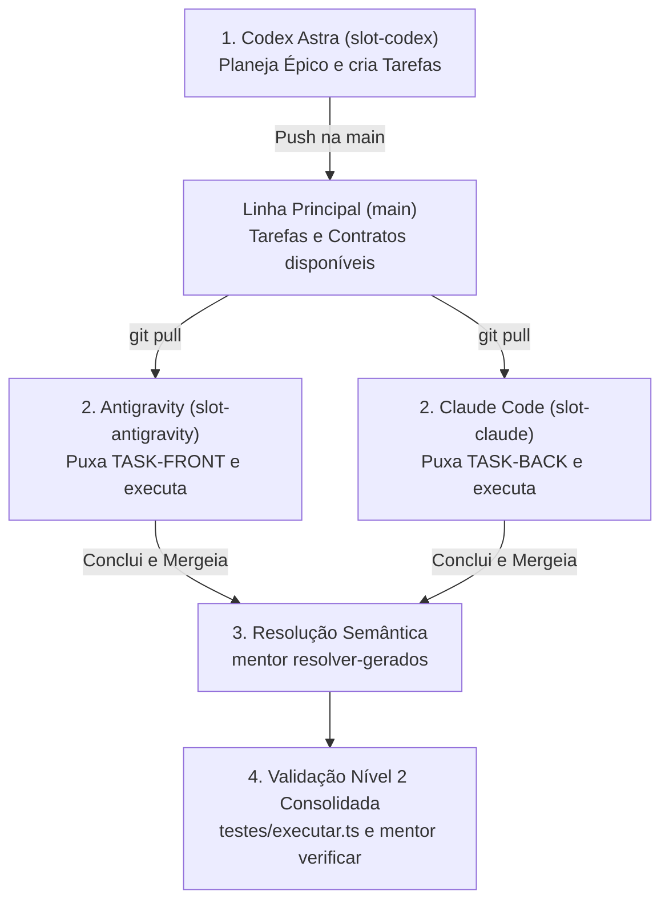

# Histórico: texto original e pedidos do mantenedor

Este arquivo preserva integralmente a proposta recebida. É referência histórica; os documentos 01–03 e os contratos das fatias contêm a direção revisada. As associações fixas entre modelos e frentes, as garantias absolutas de ausência de conflitos e os exemplos de checkout de main em vários slots foram corrigidos no planejamento atual.

## Correção expressa do mantenedor

> reveja o planjamento.
> Nenhum modelo tem papel fixo, é so exemplo de divisão pre-pronto para trabalhar com varios ao mesmo tempo

## Pedido de salvamento

> ok, cria o planejamento detalhado do epico e deixe salvo no repositorio do mentor para posterior execução de outro modelo

## Proposta recebida, integral

Este é um cenário de **equipe paralela de engenharia (3 seniores autônomos)**, onde cada IA tem ownership de ponta a ponta sobre sua frente (ex.: Codex planeja ou faz spike, Antigravity toca o Front, Claude toca o Back).

Criar workspace isolado e branch temporária por tarefa **é o caminho correto**, mas se você criar e destruir worktrees do zero a cada tarefa, vai perder tempo reinstalando `node_modules` e reabrindo IDEs.

Abaixo está o **Protocolo Padrão Multi-Sênior do Mentor**, desenhado para rodar 2 ou 3 IAs ao mesmo tempo com o mínimo de atrito.

---

### 1. A Topologia: "3 Slots de Worktree Fixos"

Em vez de criar e deletar worktrees dinamicamente a cada 40 minutos, o método mais eficiente é manter **3 slots de worktree permanentes** apontando para o mesmo Git:

```text
meu-projeto/
├── slot-codex/          # Onde o Codex Astra vive (Planejamentos, Spikes, Chores)
├── slot-antigravity/    # Onde o Antigravity vive (Front-end, UI, Ferramentas)
└── slot-claude/         # Onde o Claude Code vive (Back-end, Core, Testes pesados)
```

#### Por que isso é muito melhor que worktree efêmera por tarefa?
1. **`node_modules` e caches prontos**: Você roda `npm install` uma vez em cada slot.
2. **Ambiente configurado**: As IDEs/terminais já ficam abertas nas suas respectivas pastas.
3. **Mudança instantânea de tarefa**: Quando um sênior termina uma tarefa, ele simplesmente faz checkout de uma nova branch no seu slot sem tocar no disco do outro.

#### Como criar os 3 slots (executar uma única vez):
```bash
# Na pasta do seu projeto principal (que será o slot-antigravity):
git worktree add ../slot-codex -b work/codex-idle
git worktree add ../slot-claude -b work/claude-idle

# Instala dependências em cada um:
cd ../slot-codex && npm install
cd ../slot-claude && npm install
```

---

### 2. O Fluxo de Trabalho: Do Planejamento à Execução

Como o **Codex Astra** é o planejador principal e o **Antigravity** e o **Claude** são os executores:



#### Passo 1: O Codex planeja o Épico
No `slot-codex`:
1. Codex cria o plano do épico e as tarefas no Mentor:
   - `mentor task nova --tipo RF --titulo "Interface do Dashboard" ...` -> gera `TASK-RF-001` (Front)
   - `mentor task nova --tipo RF --titulo "API de Agregação" ...` -> gera `TASK-RF-002` (Back)
2. Codex faz commit e push do planejamento:
   ```bash
   git commit -m "docs(plano): planejar epico de dashboard e contratos"
   git push origin main
   ```
   *(Ou se usar PRs, abre PR de planejamento `(plano)` que passa na esteira sem código).*

#### Passo 2: Os Seniores assumem suas frentes simultaneamente

- **No `slot-antigravity` (Front-end)**:
  ```bash
  git pull origin main
  git checkout -b task/TASK-RF-001
  mentor task puxar TASK-RF-001
  mentor task iniciar TASK-RF-001
  # Antigravity implementa, roda testes locais da fatia
  mentor task gate TASK-RF-001 testes
  mentor task finalizar TASK-RF-001
  git commit -m "feat(TASK-RF-001): construir componentes de dashboard"
  ```

- **No `slot-claude` (Back-end) — ao mesmo tempo**:
  ```bash
  git pull origin main
  git checkout -b task/TASK-RF-002
  mentor task puxar TASK-RF-002
  mentor task iniciar TASK-RF-002
  # Claude implementa, roda testes locais da fatia
  mentor task gate TASK-RF-002 testes
  mentor task finalizar TASK-RF-002
  git commit -m "feat(TASK-RF-002): criar endpoints de agregacao"
  ```

---

### 3. Protocolo de Integração Sem Conflito (First-to-Merge)

Como cada sênior mexe em arquivos de código diferentes (`src/front/` vs `src/api/`), **o código nunca vai conflitar**.

O único lugar onde o Git vai acusar divergência são os arquivos gerados pelo Mentor (`docs/contexto.json`, `docs/tarefas/backlog.md`, `docs/tarefas/recusas.jsonl`), porque ambos finalizaram tarefas.

Aqui entra a regra do **First-to-Merge**:

#### Quem terminar primeiro (ex.: Claude):
1. Faz merge direto na `main` e sobe:
   ```bash
   git checkout main && git pull
   git merge task/TASK-RF-002
   git push origin main
   ```

#### Quem terminar em segundo (ex.: Antigravity):
1. Atualiza seu ramo com o trabalho que acabou de entrar na `main`:
   ```bash
   git merge origin/main
   ```
2. Se o Git acusar conflito nos arquivos do Mentor (`contexto.json`, `backlog.md`, etc.), **não resolva na mão**. Execute:
   ```bash
   mentor resolver-gerados
   ```
   *O Mentor faz a fusão 3-way automática dos metadados, une os registros e regenera todo o markdown.*
3. Conclui o merge e entrega:
   ```bash
   git commit -m "merge: integrar main com TASK-RF-001 resolvida"
   git checkout main && git merge task/TASK-RF-001
   git push origin main
   ```

---

### 4. Limites e Regras Inegociáveis de Concorrência

Para garantir que ninguém quebre o outro:

| Regra | Como funciona | Por que evita atrito |
| :--- | :--- | :--- |
| **Disjunção estrita de `plano.muda`** | Duas tarefas paralelas nunca declaram os mesmos arquivos de produção. | Se um toca Front e outro Back, o Git dá merge trivial (fast-forward ou recursive limpo). |
| **Portas de Dev Server** | Se ambos precisarem subir a aplicação localmente para testar: slot A usa `3000`, slot B usa `3001` (via `.env.local` na worktree). | Evita erro de `EADDRINUSE`. |
| **1 Tarefa em execução por slot** | Cada IA só dá `task iniciar` na **sua** tarefa dentro do **seu** slot. | Respeita a salvaguarda local do Mentor (`0 de 1 em execucao`). |
| **Gates Nível 1 vs Nível 2** | Durante a tarefa, cada sênior roda apenas o **Nível 1** (testes da sua própria fatia). O **Nível 2** (suíte completa de 32 cenários/E2E) roda só na hora de consolidar a `main`. | Economiza tempo e evita que um sênior rode testes de algo que o outro ainda não terminou de subir. |

---

### 5. Resumo da Resposta: "Criar workspace e branch por task é suficiente?"

**Sim, é suficiente e é o padrão da indústria**, contanto que:
1. Você use **3 slots fixos de Git Worktree** (`slot-codex`, `slot-antigravity`, `slot-claude`) para não ficar recriando pastas nem reinstalando dependências.
2. Cada IA crie sua branch de tarefa (`task/<ID>`) dentro do seu próprio slot.
3. Você use o comando nativo **`mentor resolver-gerados`** ao juntar as branches, eliminando qualquer atrito nos arquivos de ciclo do Mentor.
